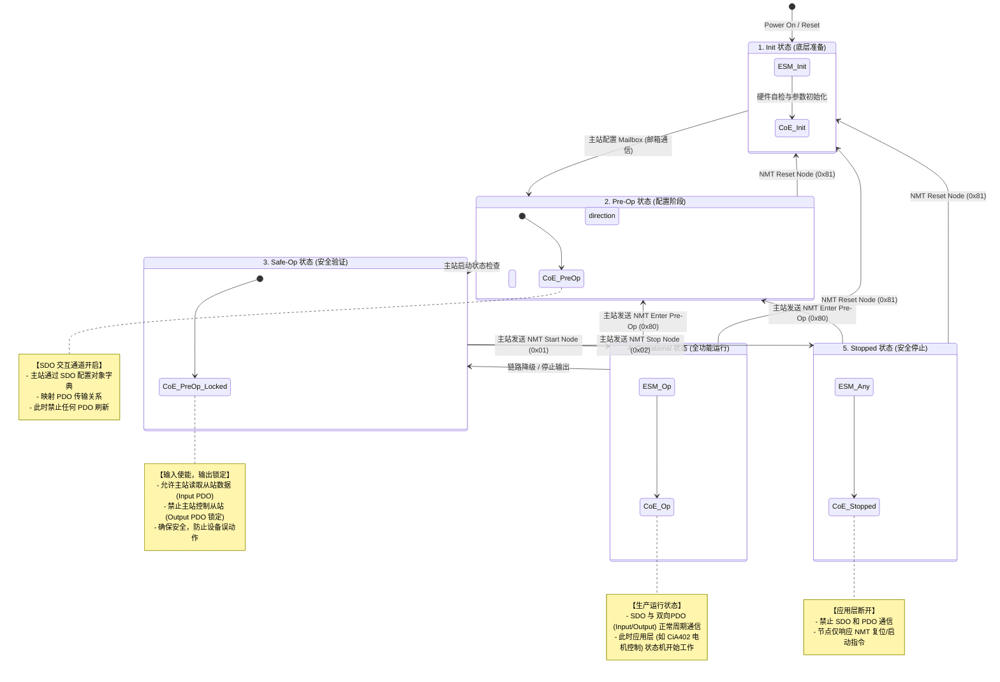

ECAT_StateChange
    AL_ControlInd

COE的状态机图如下所示
+---------------------------------------------------------------------------------+
|                                 POWER ON / RESET                                |
+---------------------------------------------------------------------------------+
                                         |
                                         v
+---------------------------------------------------------------------------------+
| ESM: Init                 |  CoE: Initialization                                |
+---------------------------------------------------------------------------------+
                                         |
                                         | (主站配置邮箱通信 / 自动初始化完成)
                                         v
+---------------------------------------------------------------------------------+
| ESM: Pre-Operational      |  CoE: Pre-Operational                               |
|                           |  - 允许 SDO 读写对象字典 (OD)                       |
|                           |  - 禁止 PDO 过程数据传输                            |
+---------------------------------------------------------------------------------+
                                         |
                                         | (主站配置 PDO 映射并请求切换)
                                         v
+---------------------------------------------------------------------------------+
| ESM: Safe-Operational     |  CoE: Pre-Operational                               |
|                           |  - 允许 SDO 通信                                    |
|                           |  - 仅允许 输入PDO (Input/TxPDO) 刷新                |
+---------------------------------------------------------------------------------+
                                         |
                      +------------------+------------------+
                      | (Start Remote Node 0x01)            | (Stop Node 0x02)
                      v                                     v
+-----------------------------------------+   +-----------------------------------+
| ESM: Operational    | CoE: Operational  |   | ESM: Safe-Op/Op | CoE: Stopped    |
| - 允许 SDO 通信                         |   | - 停止所有 SDO 和 PDO 通信        |
| - 允许 双向PDO (Input/Output) 周期刷新  |   | - 仅响应 NMT 基础网络管理命令     |
| - 电机驱动(CiA402)在此状态下使能工作    |   |                                   |
+-----------------------------------------+   +-----------------------------------+
                      |                                     |
                      +------------------<------------------+
                                  (Enter Pre-Op 0x80)

状态                 AL 控制码          核心定位                CoE通信能力
INIT（初始化）	       0x01    硬件基础通信就绪，无上层配置	   无邮箱 / PDO 通信
PREOP（预运行）        0x02	   CoE 配置阶段，SDO 参数读写     仅 SM0/SM1 邮箱 (SDO/CoE)，无周期 PDO
SAFEOP（安全运行）     0x08     周期 PDO 校验，输出安全锁定    邮箱 + 周期输入 PDO 有效，输出强制安全值
OP （运行）            0x10     完整实时控制，全功能 PDO	  邮箱 + 输入 / 输出 PDO 全部正常交互
Bootstrap（引导，可选）	0x04	FoE 固件升级专用	          仅 FoE 文件下载通信
